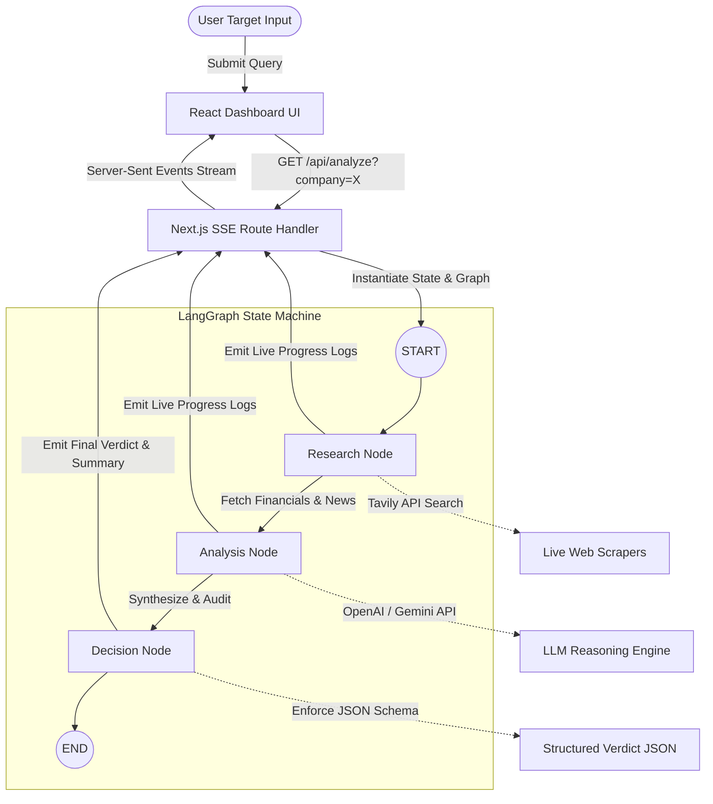

# AlphaAgent // AI Investment Research Agent

AlphaAgent is an autonomous financial research agent that automates the target analysis phase of equity and startup evaluations. The system receives a company name, conducts live web searches for financial filings and current press news, performs analyst reasoning, and outputs a structured "Invest" or "Pass" verdict with detailed supporting parameters.

Built as an internship assignment for **InsideIIM × Altuni AI Labs**, the app balances raw data aggregation, structured AI reasoning, and a high-fidelity visual interface.

---

## Key Features

- **Autonomous Research Pipeline**: Powered by **LangGraph.js**, the agent dynamically schedules and routes research steps sequentially.
- **Dual-Source Ingestion**: Queries the **Tavily Search API** to fetch cleaned web text for both corporate financial reports (revenue, margins, debt) and news developments.
- **Hybrid LLM Resolution**: Dynamically routes analysis to **Google Gemini** or **OpenAI GPT** models depending on which API key is configured.
- **Fail-safe Mock Fallbacks**: Includes a built-in pre-compiled financial index. If API keys are missing, the system automatically runs mock evaluations for **Zomato**, **Infosys**, and **SaaSify AI** to guarantee testing usability out-of-the-box.
- **Real-Time Terminal Streaming**: Leverages **Server-Sent Events (SSE)** to stream step-by-step orchestrator CLI outputs to the browser during graph node transitions.
- **Premium Bloomberg-Style Interface**: Crafted in **pure Vanilla CSS** (no heavy CSS frameworks) featuring carbon-dark background layouts, neon active signals, custom indicators, and interactive tab panels.

---

## How It Works (Architecture)



1. **State Initialization**: The Next.js API route instantiates a new StateGraph containing the target `companyName`.
2. **Research Node**: Resolves the target's stock ticker (via regex matching and lookup heuristics) and queries the Tavily Search API with targeted search parameters.
3. **Analysis Node**: Feeds compiled text outputs to the LLM (Gemini or OpenAI) to formulate an exhaustive analyst report evaluating growth metrics, debt ratios, margin trends, and news sentiment.
4. **Decision Node**: Runs the analyst report through a final investment filter, rendering an "INVEST" or "PASS" verdict, a matching confidence score, and structures the findings into a strict JSON schema.
5. **Streaming Output**: Logs are collected at each node transition and sent via SSE to the clientside terminal.

---

## How to Run

### 1. Clone & Install Dependencies
Ensure you have **Node.js (v18+)** and **npm** installed.

```bash
git clone https://github.com/chandan91077/investment-research-agent.git
cd investment-research-agent
npm install
```

### 2. Configure Environment Variables
Copy the env template and populate your API credentials:

```bash
cp .env.local.example .env.local
```

Open `.env.local` and add your keys:
```env
TAVILY_API_KEY=your_tavily_key_here
GEMINI_API_KEY=your_gemini_key_here
# OR
# OPENAI_API_KEY=your_openai_key_here
```
*Note: If no API keys are provided in `.env.local`, the application will enter **Mock Mode**, allowing you to fully test the interface using the pre-compiled datasets for Zomato, Infosys, and SaaSify AI.*

### 3. Launch Development Server
```bash
npm run dev
```
Open [http://localhost:3000](http://localhost:3000) in your browser to view the application.

---

## Key Decisions & Trade-offs

1. **Vanilla CSS vs. Tailwind**: To achieve a bespoke, premium dashboard aesthetic resembling a modern SaaS terminal, we opted for **Vanilla CSS (`globals.css`)** with HSL variables. This avoided the uniform look of generic Tailwind layouts and eliminated configuration overhead.
2. **Next.js Route Handlers for SSE**: Rather than using socket connections or polling, we implemented a Next.js Server-Sent Events handler using native Web Streams. This maintains a lightweight, stateless server setup while allowing real-time terminal output.
3. **Zero-Library Tavily Integration**: Instead of installing heavy community packages, we implemented a custom HTTP fetch wrapper for Tavily. This minimized package weight, reduced potential peer dependency conflicts, and provided a clean, custom mock data intercept.
4. **LLM Agnostic Graph Node Design**: The model selection logic is isolated to a helper module (`src/lib/agent/llm.ts`), enabling easy hot-swapping between Gemini and OpenAI models.

---

## Example Evaluation Runs

### 1. Zomato
- **Verdict**: `INVEST` ✅
- **Confidence Score**: `85%`
- **Growth Outlook**: Quick commerce division (Blinkit) is exhibiting explosive scale (+90% YoY), recently crossing operational EBITDA breakeven. Food delivery remains highly stable, serving as a reliable cash flow generator.
- **Risk Factors**: Intense competition from Swiggy (post-IPO) and Zepto. Potential regulatory margins squeeze regarding gig worker welfare laws.
- **Market Sentiment**: Highly bullish among institutional brokerages following Blinkit's operational turnaround.
- **Financial Highlights**:
  - Q4 Revenue: INR 3,850 Cr (+35% YoY)
  - Net Profit: INR 250 Cr
  - Quick Commerce Growth: +90% (EBITDA positive)

### 2. Infosys
- **Verdict**: `PASS` ❌
- **Confidence Score**: `72%`
- **Growth Outlook**: Digital service core is resilient (62.5% of business), and the company is securing multi-year AI deals (such as the $1.5B Topaz Banking contract).
- **Risk Factors**: Enterprise customers are aggressively cutting back on discretionary software upgrades, resulting in constant-currency growth falling to 2.5%. Operating margins contracted by 80 bps to 20.2% due to low talent utilization.
- **Market Sentiment**: Highly cautious. Institutional desks are holding target prices due to sluggish guidance and headwinds in global enterprise spending.
- **Financial Highlights**:
  - Revenue Growth: +2.5% CC (Missed guidance)
  - Operating Margin: 20.2% (-80 bps YoY)
  - Net Profit: INR 26,400 Cr (+1.8% YoY)

### 3. SaaSify AI (Custom Startup)
- **Verdict**: `INVEST` ✅
- **Confidence Score**: `78%`
- **Growth Outlook**: Incredible product velocity. ARR reaches $2.4M growing at 250% YoY, backed by high-quality Net Revenue Retention (132%) indicating high enterprise upsell success.
- **Risk Factors**: Elevated burn rate ($300k/month) against $12M Series A, leaving only 8 months of runway. High hosting/GPU infrastructure costs.
- **Market Sentiment**: High venture capital interest for upcoming Series B, though mid-market clients raise operational longevity questions.
- **Financial Highlights**:
  - ARR: $2.4M (+250% YoY)
  - Gross Profit Margin: 78.0%
  - Net Revenue Retention: 132.0%

---

## What I'd Improve With More Time

1. **Recursive Vector Retrieval**: Implement a vector database (like Pinecone) to index scraped content, enabling semantic retrieval of specific balance sheet footnotes.
2. **Multi-Agent Debates**: Setup a LangGraph workflow with two opposing nodes ("Bull Analyst" vs "Bear Analyst") debating the valuation before passing data to the "Committee Chair" node.
3. **Historical Data Plotting**: Integrate a charting library (like Recharts) in the UI to visualize 3-year historical revenue and margin trajectories.

---

## 🎁 Bonus: LLM Pair-Programming Transcript

As part of the assignment requirements to detail my engineering approach and interactive pair-programming sessions with the LLM, the full session transcripts are recorded inside:
*   [LLM_CHAT_TRANSCRIPT.md](file:///c:/Users/chand/OneDrive/Desktop/papa/investment-research-agent/LLM_CHAT_TRANSCRIPT.md)

This log shows our developer journey: designing schemas, configuring search nodes, implementing Vercel fallback compatibility, and fixing model 404 access restrictions.
